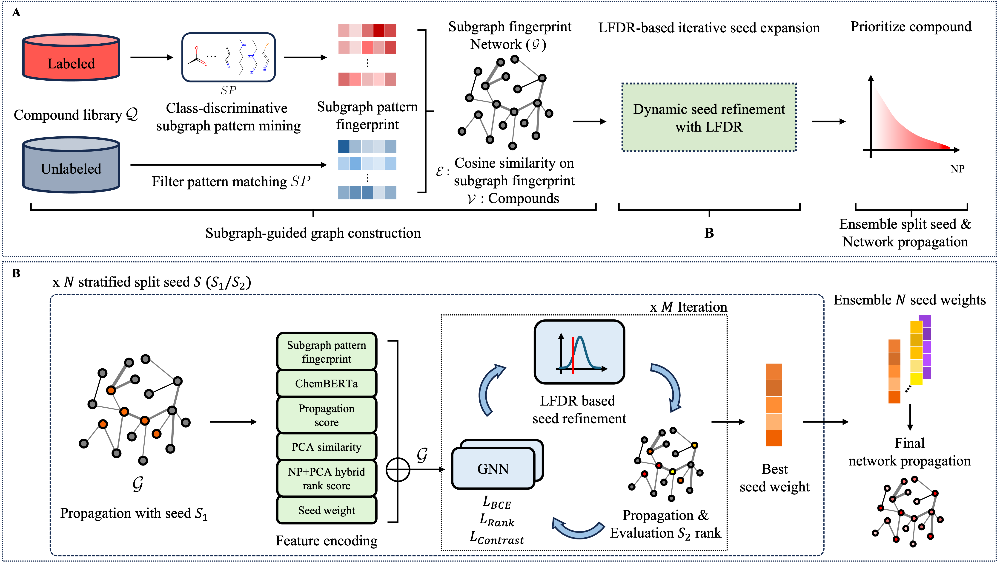

# SubDyve: Subgraph-Driven Dynamic Propagation for Virtual Screening Enhancement Controlling False Positive



---

## General

This is the official implementation of **SubDyve**, a graph-based virtual screening framework that performs label-efficient compound prioritization by constructing a **subgraph fingerprint graph** using class-discriminative substructures. It iteratively refines seed nodes through **LFDR-based propagation**.
SubDyve is designed to work in **low-label regimes**, where only a few known actives are available for a given target protein.


### System Requirements

- **GPU:** NVIDIA RTX A6000 (49GB)
- **CPU:** Intel Xeon Gold 6248R @ 3.00GHz (48 cores)
- **OS:** Ubuntu 22.04.4 LTS
- **Python:** >=3.9
- **CUDA:** 11.1
- **PyTorch:** 1.10.1 + cu111
- **PyTorch Geometric:** 2.0.4
- **scikit-learn:** 1.6.1
- **scipy:** 1.10.1


## Installation

### 1. Create a Conda environment

```bash
conda create -n subdyve python=3.9
conda activate subdyve
```

### 2. Install dependencies

```bash
pip install -r requirements.txt
pip install torch==1.10.1+cu111 torchvision==0.11.2+cu111 torchaudio==0.10.1 -f https://download.pytorch.org/whl/cu111/torch_stable.html

```

### 3. Install PyTorch Geometric (adjust CUDA version if needed)

```bash
pip install torch torch_geometric torch_scatter torch_sparse torch_cluster \
  -f https://data.pyg.org/whl/torch-1.10.1+cu111.html
pip install torch_geometric==2.0.4
```

---

## Dataset and Features

You can download the complete preprocessed datasets and features from [Figshare](https://figshare.com/s/d99dadd6c6aaa884558a).
This includes everything needed to reproduce both DUD-E and PU (PubChem-based) experiments.

After extracting the archive, the folder structure will be:

```
SubDyve/
├── data/ # DUD-E targets + PubChem-derived seed data
│ ├── DUD-E/
│ └── PU(zinc_pubchem_curated)/
├── exp_PU/ # Precomputed fingerprints and graphs for PU experiments
├── source/ # SubDyve graph construction, propagation scripts
├── SSM/ # Supervised subgraph mining algorithm scripts, including precomputed patterns
├── SUBMINE/ # SSubgraph pattern fingerprint construction including precomputed fingerprints, ChemBERTa-77M-MTR features for DUD-E.
```


**Provided resources include:**

- Canonicalized SMILES (`ACTIVE_DATA.csv`, `DECOY_DATA.csv`)
- Seed compounds from MMseqs2 search (`SEED_DATA.csv`)
- Subgraph fingerprints (`FP_*.pickle`)
- ChemBERTa embeddings (`DeepChem_ChemBERTa-77M-MTR_*.pkl`)
- Graph structure (`edge_*.txt`, `seed_*.txt`) for propagation in PU settings

This setup enables full reproducibility of the experiments without additional data processing.

---

## How to Run Experiments

### DUD-E Experiments

1. Clone the repository and `cd` into the `SubDyve/` directory.
2. Run subgraph pattern mining:

```bash
./SSM/mine_subgraph.sh
```
3. Before proceeding, Copy the downloaded Figshare files into the working directory to enable network propagation.
4. Run subgraph fingerprint generation and network propagation with SubDyve:
```bash
./DUDE_SUBDYVE.sh
```
This pipeline performs:

- Supervised subgraph mining using SSM
- Subgraph-based fingerprint construction
- Graph construction + LFDR-guided propagation
- Score ranking 

### PU (PubChem + ZINC) Experiments
PU screening experiments are run separately using the following script:
```bash
./PU_SUBDYVE.sh
```
This utilizes precomputed subgraph patterns and embeddings stored in exp_PU/.

---
We report standard virtual screening metrics including:

→ BEDROC and Enrichment Factor(EF) are computed using RDKit’s rdkit.ML.Scoring.Scoring module (see [RDKit docs](https://www.rdkit.org/docs/source/rdkit.ML.Scoring.Scoring.html)) and scikit-learn for AUROC.

To assess robustness, we apply bootstrapped evaluation (100 iterations) to estimate the mean and standard deviation of each metric.
